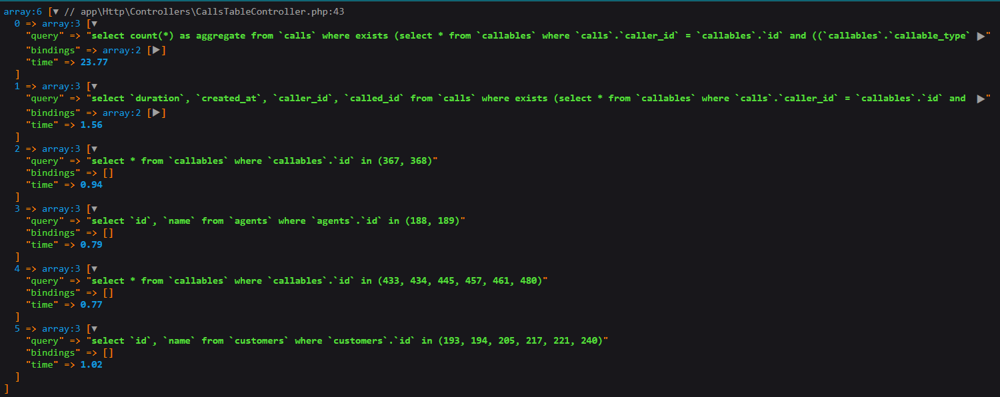

## Notes
I prepared a seeder so that you can run php artisan migrate --seed before testing the project.

## Assumptions
1) The agent can call any customer, not only assigned to him. If we need to show only assigned calls, we can easily add another condition in the controller.
2) Anyone can call anybody, and in the future, we can add other entities except agents and customers.
3) The duration of the call is a number of seconds.

## Steps taken
1) Created agents and customers tables. Created table agent-customers to create many-to many relation between agents and customers (though, it is not used for table display now).
2) Created 'callables' table (id, callable_id, callable_type) and interface with trait for customers and agents. Each agent and each customer has an id in 'callables'.
3) Created a 'call' table. 'Caller_id' and 'called_id' are ids from callables.
4) Created controller for a table with index method and placed html in welcome.blade.
5) For choosing a period of time added datepicker.

## Bonus - speed up the loading
1) We can eliminate the table 'callables', and in 'call' table add agent_id, customer_id instead of caller_id and called_id, and the direction of call (if customers can also call). Table loading will be faster, __BUT__ it will close this table for extensions (we will not be able to add another entities).
2) We can add an index by agent name if we need to search by agent name often. __BUT__ it will slow down adding new agents.
3) We can replace eloquent methods with almost raw sql-request like DB::raw("select .. join... limit... offset..."). This will be faster, because now we take 5 sql-request to database, and DB::raw will do only one. __BUT__ this code maybe will be hard to maintain in the future. Also, if we decide to create raw sql-request, we can hide part of the request in view. 

## TO DO
1) I would add CallTableResource to simplify the outcoming data, but I've stuck a little bit with how the blade works with the resource, as I usually do not use blades, but I'm 100% sure it could be done.
2) I would also replace get request with post request as it seems safer for filtering. Moreover, CallTableRequest should also be created to validate the user's input.
